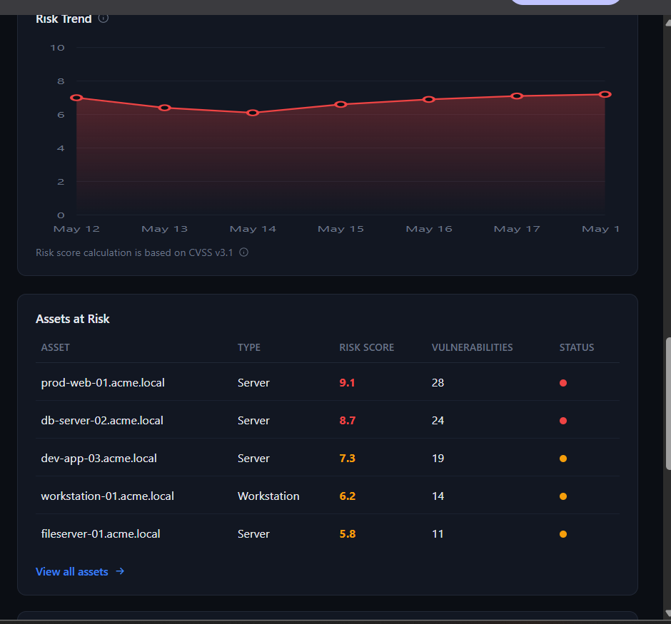
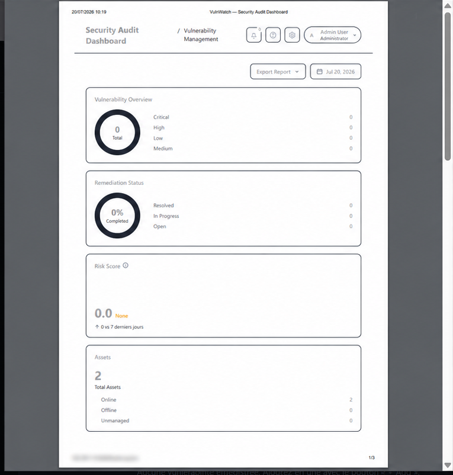

<div align="center">

# 🛡️ VulnWatch

### Security Audit & Vulnerability Management Dashboard

A modern web dashboard for tracking assets, vulnerabilities, remediation progress, risk scores and security reports from one interface.

<br>


</div>

---

## Overview

**VulnWatch** is a personal cybersecurity and software-development project designed to provide a clear overview of an organization's security posture.

The application brings together asset monitoring, vulnerability records, CVSS-based risk information, remediation tracking, compliance data and printable reports in a responsive dark-themed dashboard.

> This repository is a portfolio and educational project. It is not a replacement for a professional vulnerability scanner or a production security platform.

---

## Screenshots

### Security dashboard



### Printable security report



---

## Main Features

- **Security overview** with key indicators and vulnerability statistics
- **Asset inventory** with type, status, risk score and vulnerability count
- **Vulnerability management** with severity and remediation information
- **CVSS v3.1 risk trend** visualization
- **Scan history** and scan-status views
- **Remediation tracking** for open, in-progress and resolved findings
- **Compliance overview**
- **Policies and integrations** sections
- **Printable security reports**
- **Responsive dark interface**
- **REST-style API endpoints** used by the dashboard

---

## Technology Stack

| Area | Technologies |
|---|---|
| Backend | Python, Flask |
| Frontend | HTML, CSS, JavaScript |
| API | JSON REST endpoints |
| Interface | Responsive custom dashboard |
| Risk model | CVSS v3.1-oriented scoring |
| Reports | Browser print / PDF export |

---

## Dashboard API Routes

The current interface requests data from routes such as:

| Endpoint | Purpose |
|---|---|
| `/api/overview` | Global dashboard overview |
| `/api/assets-summary` | Asset statistics |
| `/api/risk-score` | Current risk score and trend |
| `/api/assets-at-risk` | Highest-risk assets |
| `/api/vulnerabilities` | Vulnerability records |
| `/api/scans` | Scan information |
| `/api/remediation` | Remediation progress |
| `/api/compliance` | Compliance data |

---

## Getting Started

### Prerequisites

- Python 3
- Git
- A modern web browser

### Installation

```bash
git clone https://github.com/Snyzz-dev/VulnWatch.git
cd VulnWatch
```

Create a virtual environment:

#### Windows

```powershell
py -m venv .venv
.venv\Scripts\activate
```

#### Linux / macOS

```bash
python3 -m venv .venv
source .venv/bin/activate
```

Install the dependencies:

```bash
python -m pip install -r requirements.txt
```

On Windows, this command can also be used:

```powershell
py -m pip install -r requirements.txt
```

Start the application:

```bash
python app.py
```

Then open:

```text
http://127.0.0.1:5000
```

> Rename the startup file in the command above if your main Flask file has a different name.

---

## Suggested Project Structure

```text
VulnWatch/
├── app.py
├── requirements.txt
├── static/
│   ├── css/
│   │   └── style.css
│   ├── js/
│   │   └── dashboard.js
│   └── images/
├── templates/
│   └── index.html
├── assets/
│   └── screenshots/
└── README.md
```

---

## Security Notes

- Use VulnWatch only with systems and data you own or are explicitly authorized to assess.
- Never commit passwords, API keys, session secrets or sensitive scan data.
- Disable the Flask debugger before any public or production deployment.
- Do not expose the development server directly to the internet.
- Replace demonstration data with properly protected storage before production use.
- Apply authentication, authorization, CSRF protection, validation and secure session settings before deployment.

---

## Roadmap

- [ ] Authentication and role-based access control
- [ ] Persistent database storage
- [ ] Import of vulnerability scan results
- [ ] Search, filters and pagination
- [ ] CVE enrichment
- [ ] Email or webhook notifications
- [ ] Improved PDF report generation
- [ ] Automated tests
- [ ] Docker deployment
- [ ] Production-ready configuration

---

## Project Purpose

VulnWatch was created to demonstrate skills in:

- Full-stack web development
- Python and Flask backend development
- REST API design
- Cybersecurity dashboard design
- Vulnerability and remediation workflows
- Data visualization
- Responsive UI development
- Security-focused software architecture

---

## Author

**Leo Tillier**

- GitHub: [Snyzz-dev](https://github.com/Snyzz-dev)
- Portfolio: [leo-tillier.fr](https://snyzz-dev.github.io/leo-tillier/)
- Email: [snyzzoff@gmail.com](mailto:snyzzoff@gmail.com)
- Fiverr: [Freelance services](https://fr.fiverr.com/s/jjxzVyG)

---

<div align="center">

**Secure software starts with clear visibility.**

</div>
